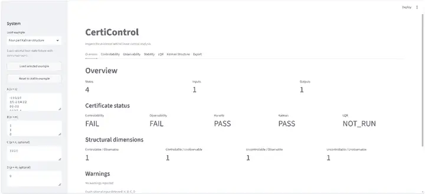
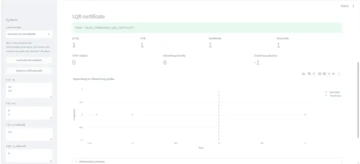
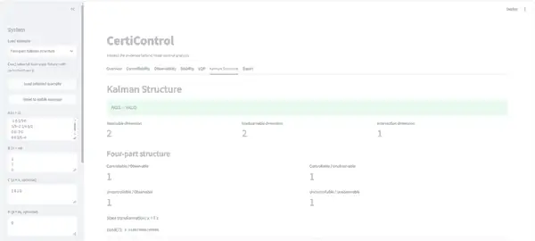

# CertiControl

**Inspect the evidence behind linear control analysis.**

[](https://github.com/dongxuelian2/CertiControl/actions/workflows/tests.yml)

CertiControl is a certificate-based toolkit for continuous-time finite-dimensional LTI systems. It exposes the mathematical evidence behind controllability, observability, stability, LQR synthesis, and Kalman structural decomposition instead of returning only final Boolean or matrix-valued answers.

**Repository:** https://github.com/dongxuelian2/CertiControl  
**Interactive app:** run locally with `streamlit run app.py`  
**Release candidate:** `0.2.0`

## Demo screenshots

### System overview



*Four-part Kalman example: a 4-state system containing one state in each controllable/observable structural class. CertiControl reports both high-level certificate status and the resulting `1 / 1 / 1 / 1` decomposition.*

### LQR / CARE certificate



*LQR certificate for an unstable but controllable system. CertiControl checks Q/R validity, stabilizability and detectability, CARE residuals, and verifies that the closed-loop poles lie in the left half-plane.*

### Kalman structural decomposition



*Full Kalman structural decomposition with reachable/unobservable dimensions, transformation conditioning, and all four structural components identified explicitly.*

The screenshots above are real captures from the running Streamlit application; repository copies are resized/compressed for fast README rendering.

## Why CertiControl?

Classical control software is excellent at computation, but many workflows expose only the final numerical result. A result such as `Controllable: True` does not show why the criterion passed, which mode failed when it did not, or whether the conclusion is sensitive to floating-point tolerance.

CertiControl turns familiar control-theory criteria into inspectable computational certificates:

- **evidence** — matrices, ranks, singular values, transformed systems;
- **witnesses** — explicit PBH failure modes for uncontrollability and unobservability;
- **residuals** — independently evaluated Lyapunov, CARE, gain, covariance, and structural identities;
- **margins** — spectral and positivity diagnostics;
- **cross-checks** — exact versus numerical paths and equivalent criteria;
- **uncertainty** — tolerance-sensitive cases remain visible as warnings or inconclusive results.

The project does not claim new control theory. Its contribution is a certificate-first way to expose classical control theory computationally.

## What it certifies

| Analysis | Inspectable evidence |
| --- | --- |
| Controllability | controllability matrix, exact/numerical rank, SVD diagnostics, PBH cross-check, failure witness |
| Observability | observability matrix, exact/numerical rank, PBH cross-check, failure witness, duality |
| Stability / Lyapunov | spectral abscissa and margin, exact/numerical Lyapunov solution, positivity evidence, residual |
| LQR / CARE | Q/R validation, stabilizability, detectability, P, K, CARE residual, closed-loop Hurwitz check, closed-loop identity |
| Kalman decomposition | reachable and unobservable subspaces, intersection, four structural dimensions, transformation, zero-block residuals |

The unified analysis layer also exposes explicit `PASS`, `FAIL`, `INCONCLUSIVE`, `NOT_RUN`, and `ERROR` states rather than conflating missing input with failure.

## Interactive demo

The Streamlit app provides seven deterministic examples and tabs for Overview, Controllability, Observability, Stability, LQR, Kalman Structure, and Export.

Recommended hackathon demo path:

1. **Four-part Kalman structure** — shows `co = cu = uo = uu = 1` and the verified structural transformation.
2. **Uncontrollable mode** — shows an explicit PBH failure witness.
3. **Unstable but controllable** — compares open-loop and LQR closed-loop poles.
4. **Tolerance-sensitive** — shows that CertiControl does not hide numerical ambiguity.

The application is offline: it does not require an API key, cloud model, remote database, or AI service.

## Quick start

```bash
git clone https://github.com/dongxuelian2/CertiControl.git
cd CertiControl
python -m pip install -e ".[app]"
streamlit run app.py
```

For development and tests:

```bash
python -m pip install -e ".[test,app]"
pytest -q
```

A Streamlit Community Cloud-compatible `requirements.txt` is also included at the repository root.

## Python API example

```python
import sympy as sp

from certicontrol import LTISystem, analyze_system

system = LTISystem(
    [[0, 1], [-2, -3]],
    [[0], [1]],
    C=[[1, 0]],
    D=[[0]],
)

analysis = analyze_system(system, Q=sp.eye(2), R=sp.Matrix([[1]]))

print(analysis.summary())
print(analysis.certificates["controllability"].diagnostics["exact_rank"])
```

Reports can be exported as Markdown or JSON through either the Streamlit app or `certicontrol.reporting`.

## Mathematical certificates

### Controllability

For

\[
\dot x = Ax + Bu,
\]

CertiControl forms

\[
\mathcal C=[B,AB,\ldots,A^{n-1}B]
\]

and cross-checks matrix rank against the PBH criterion. When controllability fails, the certificate can expose a left-eigenvector witness satisfying the expected eigenvector and input-orthogonality relations, together with residuals.

### Observability

The observability matrix

\[
\mathcal O=\begin{bmatrix}C\\CA\\\vdots\\CA^{n-1}\end{bmatrix}
\]

is checked with exact/numerical rank and PBH observability. Failure certificates can expose an unobservable right-eigenvector witness.

### Stability & Lyapunov

Spectral analysis reports the spectral abscissa, stability tolerance, margin, and dominant modes. For Lyapunov analysis, CertiControl independently verifies

\[
A^T P + PA = -Q
\]

(or the Hermitian analogue) and checks the positivity assumptions used by the certificate. Exact rational inputs can produce exact zero-residual evidence where supported.

### LQR / CARE

Continuous-time infinite-horizon state-feedback LQR verifies its prerequisites before accepting a solver result. It checks Q positive semidefinite, R positive definite, stabilizability, detectability, CARE residuals, gain consistency, and closed-loop Hurwitz stability.

It also independently evaluates

\[
A_{cl}^T P + PA_{cl} + Q + K^T R K = 0,
\]

so a returned gain is not treated as a certificate by itself.

### Kalman decomposition

CertiControl computes the reachable subspace \(\mathcal R\), unobservable subspace \(\mathcal N\), and \(\mathcal R\cap\mathcal N\), then constructs a similarity transformation organized as

```text
                     Observable   Unobservable
Controllable             co            cu
Uncontrollable           uo            uu
```

The particular complement bases are non-unique; the canonical structural information is the subspaces and dimensions. The certificate verifies invariance relations, transformation equations, conditioning, and only the zero blocks required by Kalman structure.

## Exact + numerical verification

When the input contains exact integers or rationals, CertiControl preserves a SymPy exact path wherever the implemented mathematics supports one. Numerical NumPy/SciPy calculations remain available as diagnostics and cross-checks.

This distinction matters: an exact algebraic rank and a tolerance-sensitive numerical rank are not presented as equally strong statements. The UI and reports preserve warnings rather than silently rounding ambiguity away.

## Testing

The automated suite covers more than isolated unit functions. It includes:

- textbook and analytic fixtures;
- exact/numerical cross-checks;
- PBH equivalence and witnesses;
- controllability/observability duality;
- similarity invariance;
- Lyapunov covariance;
- LQR covariance and independent residual checks;
- Kalman structural invariance and duality;
- reporting/JSON integration;
- curated-example smoke tests;
- Streamlit import and startup checks.

GitHub Actions runs on Python 3.10 and 3.13.

## Project architecture

```text
Streamlit UI
    ↓
Unified analysis / reporting
    ↓
Certificate objects
    ↓
Control-theory modules
    ↓
Exact SymPy + numerical NumPy/SciPy
```

The `certicontrol` package does not import Streamlit. The UI is a presentation layer over the public analysis API.

## Scope and limitations

Current mathematical scope:

- continuous-time, finite-dimensional LTI systems;
- small teaching/analysis models, typically `n <= 10`;
- exact rational evidence where explicitly implemented;
- numerical certificates elsewhere.

Not currently implemented: discrete-time systems, minimal realization, transfer functions, pole placement, observer synthesis, Kalman filtering, LQG, MPC, frequency-domain plots, balanced truncation, or nonlinear control.

CertiControl certificates are inspectable computational evidence. They are **not** formal proofs or safety-critical engineering certification.

## Hackathon

This repository is being packaged as a submission candidate for **InfinityX Global Hackathon 2K26**. The hackathon package lives in [`docs/`](docs/) and includes:

- [`DEVPOST_SUBMISSION.md`](docs/DEVPOST_SUBMISSION.md) — copy-ready submission draft;
- [`DEMO_SCRIPT.md`](docs/DEMO_SCRIPT.md) — 90–120 second recording plan and English voiceover;
- [`SUBMISSION_CHECKLIST.md`](docs/SUBMISSION_CHECKLIST.md) — automated versus human submission tasks;
- [`RESUME_BULLETS.md`](docs/RESUME_BULLETS.md) — reusable portfolio descriptions.

The runtime product itself does not depend on AI services. NumPy, SciPy, and SymPy provide the numerical/symbolic primitives; Streamlit and Plotly provide the interactive presentation layer.

## License

MIT — see [`LICENSE`](LICENSE).
